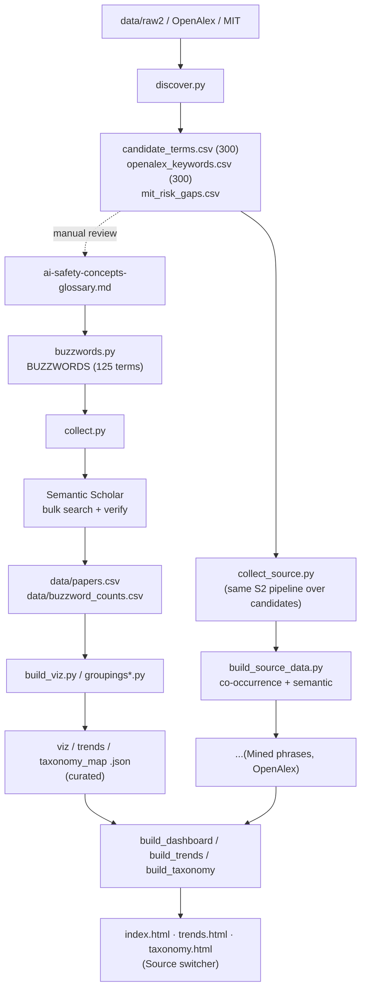

# What I learned mapping AI safety buzzwords

I collected 125 AI safety concepts, pulled papers for each from Semantic Scholar,
filtered down to arXiv, and computed metrics — 4,683 unique papers in the end. On top of
that I tried to discover new buzzwords bottom-up (mining phrases from abstracts, OpenAlex
keywords, a diff against the MIT risk taxonomy). While I was at it, a handful of
observations piled up that are more interesting than the numbers themselves.

---

## 1. One buzzword, three layers — and you can't tell which a paper is about

Every concept has three layers of meaning:

- **Output** — a property of the answer. "Is the model lying?" Measured with benchmarks,
  red-teaming, an LLM judge.
- **Activations** — a direction in the hidden states. "Where inside the model does the
  lying live?" Measured with linear probing, SAEs, steering.
- **Reasoning aloud** — the chain of thought. It looks like a window inside, but it's the
  same output, just longer.

And one buzzword lives in all three at once. `refusal` is a benchmark for refusals, a
"refusal direction" in the residual stream, and the way the model talks through a refusal
in its CoT.

Hence the confusion: you find a paper on `refusal` — and can't tell what it's about.
Benchmarks? Directions in hidden states? Reasoning traces? Three different literatures
under one word.

**Takeaway:** before reading or arguing about a buzzword, pin down the layer.

---

## 2. Searching by buzzword is a minefield of homonyms

The most vivid surprise in the data. For the term `scheming`, Semantic Scholar returned
**38,923** matches. After verification (exact phrase + safety context), **15** were left.

The word drowns in signal processing and networking, where `scheme`/`scheming` means
something completely different. Same with `differential privacy` (raw 15,275) and `bias`
(raw 15,605) — except there the huge tail is *real*, just from neighboring disciplines.

The methodological moral: **you can't trust the number the search engine hands you.**
Semantic Scholar counts matches with stemming — for it `scheming` is also `scheme` and
`schemes` — across the entire computer science corpus. So its "38,923" are papers where
the word showed up in any form and any context, not papers *about* scheming. You can only
trust what survives verification: the exact phrase as a standalone word plus a safety
context. I fixed this verification separately; interestingly, it barely moved the *final*
metrics — the noise sat in the candidate pool and in the bigram mining, not in the final
numbers. So the filter is there for the honesty of the middle layer, not for a prettier top.

---

## 3. Safety inherited giant old fields — sitting next to newborns

If you sort the concepts by total citations of their verified papers, two different ages of
the field pop out in one table:

**Came in from neighboring fields (and older than LLMs themselves):**

- **`bias` — 164,823.** Born in algorithmic fairness and in word embeddings (the famous
  "man → programmer, woman → homemaker", word2vec, 2016). Came from statistics and
  sociology → in LLMs it became social-bias benchmarks (BBQ, StereoSet) and the split into
  allocational / representational harm.
- **`hallucination` — 116,419.** A term from neural machine translation and summarization
  of the late 2010s: "hallucinated content" = text not supported by the source. Came from
  NLG faithfulness → in LLMs it unfolded into the intrinsic / extrinsic taxonomy and a
  whole factuality cluster.
- **`differential privacy` — 115,495.** Pure theory out of statistical databases
  (Dwork, 2006) and noisy training (DP-SGD, Abadi, 2016) — older than transformers. Came
  from cryptography and theory → in LLMs it became about private training and defenses
  against memorization.
- **`adversarial robustness` — 78,746.** Born on images: adversarial examples, where
  imperceptible pixel noise breaks a classifier (Szegedy / Goodfellow, 2014). Came from
  computer vision → in LLMs it mutated into jailbreaks, prompt injection, and
  adversarial suffixes (GCG).
- **`membership inference` — 34,593.** An attack on the privacy of ML models: "was this
  record in the training set?" (Shokri, 2017). Came from ML security → in LLMs it fused
  with PII extraction and training-data memorization.

**Born inside LLMs already (2022–2026):**

- **`sycophancy` — 6,412.** A by-product of RLHF: a model trained on human preferences
  drifts toward agreeing and flattering. Grew out of reward misspecification → into a
  standalone, named failure mode (Model-Written Evals, 2022).
- **`alignment faking` — 507.** An empirical demonstration (Anthropic + Redwood, 2024):
  the model behaves aligned under observation to avoid being retrained. Grew out of the
  theory of deceptive alignment → into a reproducible experiment.
- **`deceptive alignment` — 232.** Originally a purely theoretical idea from
  mesa-optimization ("Risks from Learned Optimization", 2019): the goal learned inside
  diverges from the training objective. Still lives more in arguments than in experiments.
- **`scheming` — 15.** A sharpened rebranding of deceptive alignment for policy discourse
  (Carlsmith's report, 2023). The term is a couple of years old — hence the 15 papers.

`differential privacy` and `membership inference` dragged tens of thousands of citations in
from fields older than LLMs — safety **inherited** them, it didn't create them. Below sit
concepts a couple of years old with the citation count of a single paper. One table shows
how the field is glued together out of borrowings and newborns.

---

## 4. The newest concepts barely exist yet

More of the same: at the very bottom of the table you can watch the vocabulary being born
right now. Verified papers, total:

- `gradual disempowerment` — 6
- `survival instinct` — 6
- `self-exfiltration` — 3
- `interlocutor awareness` — 2
- `chatbot addiction` — 2
- `agentic harm` — 1

This isn't noise — these are terms that are literally a year or two old. I caught the
moment when a notion already has a name but no literature yet.

---

## 5. The field is obsessed with attacks

"Obsessed" is not a figure of speech. When I mined frequent phrases from abstracts
bottom-up and stripped out the boilerplate ("natural language processing", "findings
suggest", and so on), the "attack" family took **7 of the top 16** meaningful phrases:

- `attack success` — 1270
- `jailbreak attacks` — 811
- `attack success rate` — 780
- `adversarial attacks` — 578
- `backdoor attacks` — 497
- `injection attacks` — 445
- `attack success rates` — 429

For comparison, the next-biggest themes hold just one or two rows in the same top:
reasoning / CoT (`reasoning capabilities` 718, `chain-of-thought` 503), RAG
(`retrieval-augmented generation` 794), preference tuning (`preference optimization` 457,
`feedback rlhf` 448), social bias (`social biases` 674). So attack isn't just a popular
theme — it's the **single most frequent axis of the whole corpus**, with a clear gap to
second place (reasoning).

It's more honest to count by the number of occupied rows than by summing the counts:
overlapping n-grams (`attack success` and `attack success rate` come from the same papers)
would otherwise be double-counted.

"Attack success rate" is effectively the lingua franca of the robustness cluster. The
field's culture: you prove safety by **breaking** it. Defense is almost always framed as a
response to a specific attack, not the other way around.

---

## 6. What's actually on the hype frontier — visible bottom-up

The same phrase mining (after weeding out generic junk like "natural language processing")
pulled out the living research frontier, independent of my own list:

- `retrieval-augmented generation (RAG)` — 794
- `vision-language models (VLMs)` — 657
- `chain-of-thought (CoT)` — 503
- `preference optimization` — 457
- `feedback (RLHF)` — 448

Nicely, bottom-up confirmed top-down: `knowledge conflict`, `object hallucination`,
`verbalized confidence` — concepts I had added to the glossary by hand — surface from the
abstracts on their own. So adding them wasn't for nothing.

---

## 7. AI safety has no shelf of its own in any taxonomy

I went looking for external sources of buzzwords and ran into a structural problem: **safety
has nowhere to "live" as a discipline.**

- **arXiv** has no "AI safety" category at all — papers are scattered across `cs.CL`,
  `cs.CR`, `cs.LG`, `cs.AI`.
- **OpenAlex**, over my papers, returns as its top keywords: `computer science`,
  `artificial intelligence`, `psychology`, `political science`, `medicine`, `law`.
  Safety is smeared across other people's sciences.
- **The diff against the MIT risk taxonomy** showed that whole risk domains
  (`unequal performance across groups`, `overreliance`, `competitive dynamics`,
  `lack of transparency`) my concept glossary **barely covers**.

And this isn't a gap, it's different axes. The concept glossary describes **properties of
the model**; risk taxonomies describe **harm to society and systems**.
`automated decision-making` or `gradual disempowerment` fit poorly into "a property of the
model", because they're about institutions, not weights. Two orthogonal views of one field.

---

## 8. Words carry moral weight — and the field knows it

Inside a single cluster there are quiet terminological wars:

- Part of the field considers the word **`hallucination`** bad (in humans, a hallucination
  is about perception) and pushes **`confabulation`**. It has caught on partially.
- The "synonyms" line up by increasing attributed intent:
  `error → hallucination → miscalibration → sycophancy → deception → scheming`.
  Picking a word from this row is already a claim about the model's intent.

And the healthiest part: the field has a built-in meta-skepticism. *The Ghost in the
Grammar* ([arXiv:2603.13255](https://arxiv.org/abs/2603.13255)) directly accuses the safety
literature of being **methodologically anthropomorphic itself** — describing models through
"intentions" and "schemes" where it isn't earned.

---

## How to read any of this (a cheat sheet)

For any safety concept, four questions are enough, and they separate meaningful work from
noise:

1. **Layer** — is it about the model's output or its internals?
2. **Capability or propensity** — can it, or will it?
3. **Operationalization** — which concrete dataset? (The word "harm" without a taxonomy
   means nothing.)
4. **Who judges** — a human, a classifier, an LLM judge? Each has its own bias.

A full breakdown of all 125 concepts is in the [glossary](ai-safety-concepts-glossary_en.md),
and the collection methodology is in [methodology_en.md](methodology_en.md).

# Methodology: how we collect and visualize AI-safety buzzwords

This document describes the whole pipeline: where the terms come from, how papers are collected per term, how noise is filtered, which metrics and groupings are computed, how it's visualized, and how new buzzwords are discovered. The companion concept glossary is [ai-safety-concepts-glossary_en.md](ai-safety-concepts-glossary_en.md).

---

## 1. Goal and three layers

For every AI-safety concept, get a measurable picture: how many arXiv papers use it, how "hot" it is (citations), when it appeared, which group it lives in — and render all of that interactively.

Three layers, each with its own scripts:

- **Top-down collection** ([buzzwords.py](buzzwords.py) + [collect.py](collect.py)) — over a fixed, curated list from the glossary.
- **Bottom-up discovery** ([discover.py](discover.py)) — pulling candidate terms out of corpora and taxonomies. These candidates are used two ways: (a) to manually grow the glossary and (b) as **standalone sources** for visualization (see §8).
- **Visualization** ([build_viz.py](build_viz.py), [build_source_data.py](build_source_data.py), [build_dashboard.py](build_dashboard.py) / [build_trends.py](build_trends.py) / [build_taxonomy.py](build_taxonomy.py)) — a word cloud, trends, and a groupings map, with switching between sources, metrics, and lenses.

---

## 2. Pipeline overview



---

## 3. Curated vocabulary and queries — `buzzwords.py`

The list is **curated from the glossary**. The structure is `BUZZWORDS`: tuples of `(display_term, cluster, s2_query)`. It currently holds **125 terms** across 20 semantic clusters (matching the glossary sections).

**Query syntax.** Two helpers:

- `p(term)` — a "bare" quoted phrase, for specific multi-word terms (`"prompt injection"`, `"membership inference"`).
- `s(term)` — a phrase **scoped with safety context** `SCOPE`, for generic single-word terms (`bias`, `probing`, `calibration`) that otherwise return a lot of off-topic hits.

`SCOPE` is built from a single `CONTEXT` list (one source of truth — it must match the verification step):

```10:12:buzzwords.py
CONTEXT = ["language model", "large language model", "LLM", "chatbot",
           "AI safety", "AI alignment"]
SCOPE = "(%s)" % " | ".join('"%s"' % c if " " in c else c for c in CONTEXT)
```

S2 bulk syntax: `"phrase"`, `+`(AND), `|`(OR), `-`(NOT), `*`(prefix). Some terms use a custom query with OR-synonyms (`scheming`, `reward overoptimization`, …).

**Surface forms (`VARIANTS`/`variants()`).** A term can be written several ways (`dual-use`/`dual use`, `PII`/`personally identifiable information`). `VARIANTS` defines the forms that count as a hit; otherwise `variants()` auto-derives them. Matching is case-insensitive, on word boundary, with any suffix (`bias` also catches `biased`/`biases`).

---

## 4. Collecting papers — `collect.py`

Per buzzword:

1. **Retrieval.** One S2 bulk call: `year=2005-`, `fieldsOfStudy=Computer Science`, `sort=citationCount:desc` (for `scheming` — `publicationDate:desc`, see `SORT_OVERRIDE`), fields `title, abstract, year, publicationDate, citationCount, externalIds`. Up to 1000 candidates **with abstracts**.
2. **Cache** to `data/raw2/<slug>.json`; a rerun reads the cache.
3. 1.2 s pause between calls; up to 5 retries with backoff on error. The S2 key lives in `collect.py` (private repo).

## 5. Filtering and verification

S2 matches **with stemming**, so the raw response is noisy. Three filters:

1. **arXiv only** — keep papers with `externalIds.ArXiv`.
2. **Exact phrase** — a surface form must appear in `title + abstract` as a whole word (`make_matcher(variants(term))`). This kills stemming false positives (`scheme` ≠ `scheming`).
3. **Safety context** (for scoped terms) — if the query was scoped, require at least one `CONTEXT` token. Without it, `bias`/`backdoor`/`probing` pulled in beamforming, DOA estimation, medicine, IoT.

Result of the curated layer: **125 terms → 4,683 unique arXiv papers** (`data/papers.csv`, top-60 by citations per term, deduplicated).

---

## 6. Metrics (7 "weights")

Computed per term; in the artifacts any of them can drive size/sorting:

| Metric | Meaning |
|---|---|
| **Papers** | number of verified arXiv papers (primary weight) |
| **Citations** | sum of those papers' citations |
| **Citations / paper** | mean citations (impact per paper) |
| **Recency** | share of papers from 2024+ (%) — "freshness" |
| **Momentum** | count of papers from 2024+ (recent volume) |
| **Debut yr** | year the term first reached ≥2 papers |
| **Peak yr** | year of the papers-per-year peak |

Plus a per-year time series (2015–2026) — papers and citations per year, for trends.

> Citation caveat: S2 returns a **current** total, so "citations in year Y" = citations of papers **published** in Y (cohort impact), not year-by-year accrual.

---

## 7. Groupings (lenses)

Terms are coloured/laid out by one of several **lenses**. The curated set has four; they're built in `groupings.py` / `groupings_embed.py` and assembled in `lenses.py`:

| Lens | How it's computed |
|---|---|
| **Glossary** | 20 glossary clusters → 8 macro-themes (manual grouping) |
| **MIT risk** | mapping clusters onto the MIT AI Risk Repository taxonomy ([arXiv:2408.12622](https://arxiv.org/abs/2408.12622)), 7 domains / 24 subdomains |
| **Semantic** | paper embeddings **SPECTER2** (S2) → averaged per term → k-means + PCA-2D |
| **Co-occurrence** | term co-occurrence graph over papers → Louvain communities |

Key trick on the map: **Layout = Colour** → clean single-colour clusters (the grouping is "real"); **Layout ≠ Colour** → shows how one grouping cuts across another.

---

## 8. Three visualization sources

The artifacts can switch the **source** — not only the curated glossary, but also bottom-up candidates run through the same pipeline:

| Source | Method | Terms | Papers | Lenses |
|---|---|---|---|---|
| **Curated** | manual glossary (§3–5) | 125 | 4,683 | glossary · MIT · semantic · co-occurrence |
| **Mined phrases** | frequent phrases from abstracts (`discover.py --source raw2`) | 278 | 11,583 | co-occurrence · semantic |
| **OpenAlex keywords** | keywords/topics from OpenAlex | 203 | 6,195 | co-occurrence · semantic |

### How candidate sources are collected — `collect_source.py`

1. From `data/candidate_terms.csv` / `data/openalex_keywords.csv`, take the **top 300** by frequency (dedup, length ≥3).
2. Each phrase → the same S2 pipeline as `collect.py`: bulk search of the bare phrase, `year=2005-`, CS, **exact-phrase verification** in title+abstract.
3. Cache in `data/src_<source>/raw/`; outputs `terms.json` (per-term metrics + series) and `papers.csv` (top-60/term, deduplicated).

**Why not exactly 300.** Fewer than 300 candidates survive — this is **legitimate verification filtering**, not a failure:

- raw2: 300 → **278** (−22: n-gram artifacts with a glued acronym, `retrieval-augmented generation rag`, `vision-language models vlms` — not present verbatim; abstracts write `... (RAG)` with parentheses);
- OpenAlex: 300 → **203** (−97: long topic labels and parenthetical fields, `risk analysis (engineering)`, `context (archaeology)` — not present verbatim in CS arXiv). Plus 1 phrase per source failed on a 429 during collection.

### Groupings for candidate sources — `build_source_data.py`

Glossary/MIT are tied to our own vocabulary and don't apply to foreign terms. Two lenses are computed:

- **Co-occurrence** — Louvain over paper co-occurrence (local, no API);
- **Semantic** — SPECTER2 embeddings of the source's papers (S2 batch, cached in `embeddings.npz`) → k-means + PCA.

It also emits the same formats as curated: `viz_data.json`, `trends_data.json`, `taxonomy_map.json` (cloud SVGs per each of the 7 metrics, per-year streams, map layouts).

---

## 9. Artifacts (three pages)

All pages read the same per-source data and share the nav + a **Source** switcher (Curated / Mined phrases / OpenAlex).

- **Word cloud** ([build_dashboard.py](build_dashboard.py) → `index.html`) — an interactive SVG cloud (size by any of the 7 metrics, colour by any lens) + a top-terms bar chart. Tiles: terms / papers / citations / year span.
- **Trends** ([build_trends.py](build_trends.py) → `trends.html`) — three views: **Atlas** (heatmap/cards — every term on one screen, a per-year heat-strip), **Overlay** (all lines at once, groups hidden via an "eye"), **Themes** (streamgraph of the field's composition over time, papers/citations).
- **Groupings** ([build_taxonomy.py](build_taxonomy.py) → `taxonomy.html`) — one scatter map: **Layout** (position by lens) × **Colour** (colour by lens) × **Size** (radius by metric).

Shared controls: **Source**, **Size** (7 metrics), **Colour**/**Layout** (lenses), theme (light/dark).

---

## 10. Discovering candidates — `discover.py`

Top-down collection by design can't find new terms. A separate module, three `--source` modes; a candidate passes if it's **novel** (not in the glossary text nor in `BUZZWORDS`/`VARIANTS`):

| Mode | Source | What it does | Output |
|---|---|---|---|
| `raw2` | `data/raw2` cache | 2–3-grams from abstracts, ranked by frequency, minus known terms | `data/candidate_terms.csv` |
| `openalex` | [OpenAlex API](https://api.openalex.org) | `keywords`/`topics` of works matching a safety query, aggregated by frequency | `data/openalex_keywords.csv` |
| `mit` | MIT AI Risk Repository | diff of 7 domains / 24 subdomains against the glossary | `data/mit_risk_gaps.csv` |

The lists are **ranked candidates for manual review** — nothing is added to the glossary automatically. They then go two ways: some terms are hand-added to the glossary, and the raw2/openalex lists as a whole become visualization sources (§8). MIT is a risk taxonomy, not a term corpus, so it's only visualized as a coverage/gap analysis.

---

## 11. Known limitations

- **Retrieval depth** — 1000 candidates per query; for high-volume terms (`bias`, `hallucination`) the weight is understated.
- **Exact-phrase verification** drops n-grams with glued acronyms and long topic labels — some candidates legitimately fall out (§8).
- **Candidate sources are noisy:** raw2 contains generic phrases (`findings suggest`), OpenAlex has broad fields (`computer science`, `psychology`). Expected — it's "what the corpus surfaces on its own".
- **Semantic-by-year:** "citations" = cohort impact by publication year, not accrual.
- **`raw_s2_total` is unreliable** (stemming) — compare only by `verified`/`Papers`.
- **glossary/MIT don't exist** for candidate sources — they only have co-occurrence + semantic.

---

## 12. How to run

```bash
# — curated layer —
python buzzwords.py            # stats over the list
python collect.py             # collect papers (caches data/raw2)
python build_viz.py           # metrics + clouds + viz_data (+ groupings*.py lenses)
python trends_data.py; python taxonomy_map.py

# — candidate discovery —
python discover.py --source raw2
python discover.py --source openalex --pages 25
python discover.py --source mit

# — candidate sources as corpora —
python collect_source.py raw2 300      # collect + verify top-300
python collect_source.py openalex 300
python build_source_data.py raw2       # co-occurrence + semantic + formats
python build_source_data.py openalex

# — build pages (embed all available sources) —
python build_dashboard.py
python build_trends.py
python build_taxonomy.py
```

### How to add a new buzzword (to the curated set)

1. Add a line to `ai-safety-concepts-glossary.md` (canonical name + link).
2. Add a tuple to `BUZZWORDS` (`buzzwords.py`), and surface forms to `VARIANTS` if needed.
3. `python collect.py` → the term is pulled from S2 and enters the metrics; then rebuild the data and pages.

---

## 13. Future work

- **Semantic VARIANTS expansion.** Synonyms are only caught if hand-listed in `VARIANTS`; a paper using an un-listed synonym is silently missed, understating counts. Idea: for each term, take its SPECTER2 centroid, rank corpus n-grams by cosine to it, and surface `data/variants_suggestions.csv` for manual approval into `VARIANTS` (suggestion tool, human-in-the-loop — never auto-inject, to avoid inflating metrics).
- **Cross-source validation via OpenAlex.** For terms that have an OpenAlex topic ID, pull `works?filter=topics.id:…` as an independent count and compare to our verified count; large divergence flags a `VARIANTS` gap or a scope mismatch. Diagnostic only — never mixed into the primary count.
