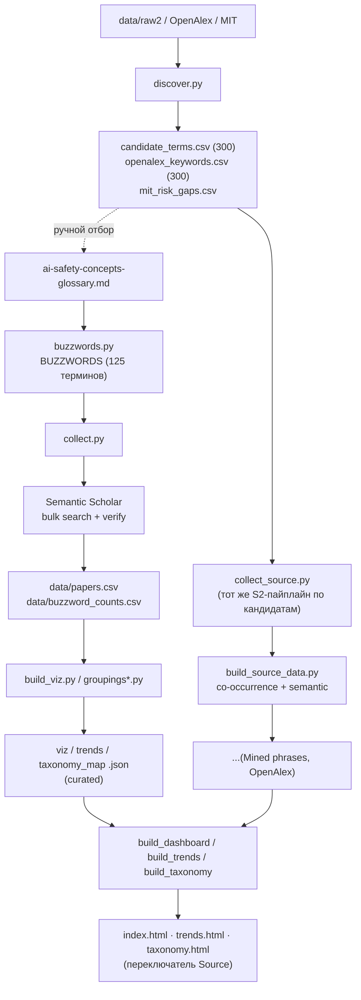

# Методология: как мы собираем и визуализируем баззворды AI Safety

Документ описывает весь конвейер: откуда берутся термины, как по ним собираются статьи, как отсеивается шум, какие метрики и группировки считаются, как это визуализируется и как искать новые баззворды. Сопутствующий словарь концептов — [ai-safety-concepts-glossary.md](ai-safety-concepts-glossary.md). English version: [methodology_en.md](methodology_en.md).

---

## 1. Цель и три слоя

Для каждого концепта AI Safety получить измеримую картину: сколько по нему статей на arXiv, насколько он «горячий» (цитирования), когда появился, в какой группе живёт — и всё это отрисовать интерактивно.

Три слоя, каждый со своими скриптами:

- **Top-down сбор** ([buzzwords.py](buzzwords.py) + [collect.py](collect.py)) — по фиксированному курированному списку из словаря.
- **Bottom-up обнаружение** ([discover.py](discover.py)) — вытаскивание кандидатов из корпусов и таксономий. Эти кандидаты используются двояко: (а) для ручного пополнения словаря и (б) как **самостоятельные источники** для визуализации (см. §8).
- **Визуализация** ([build_viz.py](build_viz.py), [build_source_data.py](build_source_data.py), [build_dashboard.py](build_dashboard.py) / [build_trends.py](build_trends.py) / [build_taxonomy.py](build_taxonomy.py)) — облако слов, тренды и карта группировок, с переключением между источниками, метриками и линзами.

---

## 2. Обзор конвейера



---

## 3. Курированный словарь и запросы — `buzzwords.py`

Список **курируется из словаря**. Структура — `BUZZWORDS`: кортежи `(display_term, cluster, s2_query)`. Сейчас **125 терминов** по 19 смысловым кластерам (разделы словаря 1–20; §10 «Umbrella taxonomies» — мета-раздел без терминов).

**Синтаксис запросов.** Два хелпера:
- `p(term)` — «голая» фраза в кавычках, для специфичных многословных терминов (`"prompt injection"`, `"membership inference"`).
- `s(term)` — фраза, **сужённая safety-контекстом** `SCOPE`, для общих однословных (`bias`, `probing`, `calibration`), дающих много офтопа.

`SCOPE` собирается из единого `CONTEXT` (одна точка правды — совпадает с проверкой на верификации):

```10:12:buzzwords.py
CONTEXT = ["language model", "large language model", "LLM", "chatbot",
           "AI safety", "AI alignment"]
SCOPE = "(%s)" % " | ".join('"%s"' % c if " " in c else c for c in CONTEXT)
```

Синтаксис bulk S2: `"фраза"`, `+`(AND), `|`(OR), `-`(NOT), `*`(префикс). Часть терминов имеют кастомный запрос с OR-синонимами (`scheming`, `reward overoptimization`, …).

**Surface-формы (`VARIANTS`/`variants()`).** Один термин пишется по-разному (`dual-use`/`dual use`, `PII`/`personally identifiable information`). `VARIANTS` задаёт формы, засчитываемые как попадание; иначе `variants()` авто-выводит их. Матчинг регистронезависимый, по границе слова, **префиксный** — ловит суффиксы (`bias`→`biased`/`biases`), но **не** смену корня (`hallucination`→`hallucinate`), поэтому такие формы приходится прописывать явно. Поверх `VARIANTS` функция `variants()` домешивает одобренные человеком семантические синонимы из `data/variants_approved.json` (см. §13).

---

## 4. Сбор статей — `collect.py`

На каждый баззворд:

1. **Retrieval.** Один bulk-вызов S2: `year=2005-`, `fieldsOfStudy=Computer Science`, `sort=citationCount:desc` (для `scheming` — `publicationDate:desc`, см. `SORT_OVERRIDE`), поля `title, abstract, year, publicationDate, citationCount, externalIds`. До 1000 кандидатов **с абстрактами**.
2. **Кэш** в `data/raw2/<slug>.json`; повторный запуск читает кэш.
3. Пауза 1.2 c между вызовами; до 5 ретраев с backoff при ошибке. Ключ S2 — в `collect.py` (репозиторий приватный).

## 5. Фильтрация и верификация

S2 матчит **со стеммингом**, поэтому сырой ответ шумит. Три фильтра:

1. **Только arXiv** — статьи с `externalIds.ArXiv`.
2. **Точная фраза** — в `title + abstract` встречается surface-форма как целое слово (`make_matcher(variants(term))`). Убирает стемминг-ложняки (`scheme` ≠ `scheming`).
3. **Safety-контекст** (для scoped-терминов) — если запрос сужён, требуем хотя бы один токен из `CONTEXT`. Без него под `bias`/`backdoor`/`probing` пролезали beamforming, DOA-estimation, медицина, IoT.

Итог курированного слоя: **125 терминов → 4 726 уникальных arXiv-статей** (`data/papers.csv`, top-60 по цитированиям на термин, дедуп).

---

## 6. Метрики (7 «весов»)

Считаются на каждый термин; в артефактах любой можно выбрать для размера/сортировки:

| Метрика | Смысл |
|---|---|
| **Papers** | число верифицированных arXiv-статей (основной вес) |
| **Citations** | сумма цитирований этих статей |
| **Citations / paper** | средняя цитируемость (импакт на статью) |
| **Recency** | доля статей с 2024+ (%) — «свежесть» |
| **Momentum** | число статей с 2024+ (недавний объём) |
| **Debut yr** | год, когда термин набрал ≥2 статей |
| **Peak yr** | год пика по числу статей |

Плюс временной ряд по годам (2015–2026) — статьи и цитаты на год, для трендов.

> Оговорка про цитаты: S2 отдаёт **текущий** total, поэтому «citations в год Y» = цитаты статей, **опубликованных** в Y (импакт когорты), а не накопление по годам.

---

## 7. Группировки (линзы)

Термины раскрашиваются/раскладываются по одной из **линз**. У курированного набора их четыре; строятся в `groupings.py` / `groupings_embed.py`, собираются в `lenses.py`:

| Линза | Как считается |
|---|---|
| **Glossary** | 20 кластеров словаря → 8 макро-тем (ручная группировка) |
| **MIT risk** | маппинг кластеров на таксономию MIT AI Risk Repository ([arXiv:2408.12622](https://arxiv.org/abs/2408.12622)), 7 доменов / 24 субдомена |
| **Semantic** | эмбеддинги статей **SPECTER2** (S2) → усреднение по термину → k-means + PCA-2D |
| **Co-occurrence** | граф со-встречаемости терминов в статьях → Louvain-сообщества |

Ключевой приём карты: **Layout = Colour** → чистые одноцветные кластеры (группировка «настоящая»); **Layout ≠ Colour** → видно, как одна группировка режет другую.

---

## 8. Три источника визуализации

Артефакты умеют переключать **источник** — не только курированный словарь, но и bottom-up кандидаты, прогнанные через тот же пайплайн:

| Источник | Метод | Терминов | Статей | Линзы |
|---|---|---|---|---|
| **Curated** | ручной словарь (§3–5) | 125 | 4 726 | glossary · MIT · semantic · co-occurrence |
| **Mined phrases** | частые фразы из абстрактов (`discover.py --source raw2`) | 278 | 11 583 | co-occurrence · semantic |
| **OpenAlex keywords** | keywords/topics из OpenAlex | 203 | 6 195 | co-occurrence · semantic |

### Как собираются candidate-источники — `collect_source.py`

1. Из `data/candidate_terms.csv` / `data/openalex_keywords.csv` берётся **топ-300** по частоте (dedup, длина ≥3).
2. Каждая фраза → тот же S2-пайплайн, что `collect.py`: bulk-поиск голой фразы, `year=2005-`, CS, **верификация точным вхождением** в title+abstract.
3. Кэш в `data/src_<source>/raw/`, вывод: `terms.json` (метрики + ряды на термин) и `papers.csv` (top-60/термин, дедуп).

**Почему не ровно 300.** Из 300 кандидатов остаётся меньше — это **легитимный отсев верификацией**, не сбой:
- raw2: 300 → **278** (−22: n-граммы со «склеенной» аббревиатурой, `retrieval-augmented generation rag`, `vision-language models vlms` — дословно в абстрактах не встречаются, там `... (RAG)` со скобками);
- OpenAlex: 300 → **203** (−97: длинные названия топиков и поля со скобками, `risk analysis (engineering)`, `context (archaeology)` — не встречаются дословно в CS-arXiv). Плюс по 1 фразе на источник упало на 429 при сборе.

### Группировки для candidate-источников — `build_source_data.py`

Glossary/MIT привязаны к нашему словарю и к чужим терминам неприменимы. Считаются две линзы:
- **Co-occurrence** — Louvain по со-встречаемости в статьях (локально, без API);
- **Semantic** — SPECTER2-эмбеддинги статей источника (S2 batch, с кэшем `embeddings.npz`) → k-means + PCA.

Плюс на выходе те же форматы, что у curated: `viz_data.json`, `trends_data.json`, `taxonomy_map.json` (облака-SVG на каждую из 7 метрик, потоки по годам, раскладки для карты).

---

## 9. Артефакты (три страницы)

Все страницы читают одни и те же per-source данные и делят навигацию + переключатель **Source** (Curated / Mined phrases / OpenAlex).

- **Word cloud** ([build_dashboard.py](build_dashboard.py) → `index.html`) — интерактивное SVG-облако (размер по любой из 7 метрик, цвет по любой линзе) + бары топ-терминов. Плитки: терминов / статей / цитат / диапазон лет.
- **Trends** ([build_trends.py](build_trends.py) → `trends.html`) — три вида: **Atlas** (heatmap/cards — все термины на одном экране, теплополоса по годам), **Overlay** (все линии сразу, группы прячутся «глазиком»), **Themes** (стримграф состава поля во времени, papers/citations).
- **Groupings** ([build_taxonomy.py](build_taxonomy.py) → `taxonomy.html`) — одна карта-scatter: **Layout** (позиция по линзе) × **Colour** (цвет по линзе) × **Size** (радиус по метрике).

Общие контролы: **Source**, **Size** (7 метрик), **Colour**/**Layout** (линзы), тема (свет/тьма).

---

## 10. Обнаружение кандидатов — `discover.py`

Top-down сбор по построению не находит новых терминов. Отдельный модуль, три режима `--source`; кандидат проходит, если **новый** (нет ни в словаре, ни в `BUZZWORDS`/`VARIANTS`):

| Режим | Источник | Что делает | Выход |
|---|---|---|---|
| `raw2` | кэш `data/raw2` | би/три-граммы из абстрактов, ранг по частоте, вычет известного | `data/candidate_terms.csv` |
| `openalex` | [OpenAlex API](https://api.openalex.org) | поля `keywords`/`topics` работ по safety-запросу, агрегат по частоте | `data/openalex_keywords.csv` |
| `mit` | MIT AI Risk Repository | дифф 7 доменов / 24 субдомена против словаря | `data/mit_risk_gaps.csv` |

Списки — **ранжированные кандидаты для ручного ревью**; в словарь автоматически ничего не попадает. Дальше они идут двумя путями: часть руками заносится в словарь, а списки raw2/openalex целиком становятся источниками визуализации (§8). MIT — таксономия рисков, не корпус терминов, поэтому визуализируется только как gap-анализ покрытия.

---

## 11. Известные ограничения

- **Глубина ретрива** — 1000 кандидатов на запрос; для массовых терминов (`bias`, `hallucination`) вес занижен.
- **Верификация точной фразой** режет n-граммы со склеенными аббревиатурами и длинные названия топиков — часть кандидатов законно отваливается (§8).
- **candidate-источники шумны:** raw2 содержит генерик-фразы (`findings suggest`), OpenAlex — широкие поля (`computer science`, `psychology`). Это ожидаемо — «что корпус выдаёт сам по себе».
- **Semantic по годам:** «citations» = импакт когорты по году публикации, не накопление.
- **`raw_s2_total` недостоверен** (стемминг) — сравнивать только по `verified`/`Papers`.
- **glossary/MIT не существуют** для candidate-источников — у них только co-occurrence + semantic.

---

## 12. Как запускать

```bash
# — курированный слой —
python buzzwords.py            # статистика по списку
python collect.py             # сбор статей (кэш data/raw2)
python build_viz.py           # метрики + облака + viz_data (+ groupings*.py линзы)
python trends_data.py; python taxonomy_map.py

# — обнаружение кандидатов —
python discover.py --source raw2
python discover.py --source openalex --pages 25
python discover.py --source mit

# — candidate-источники как корпуса —
python collect_source.py raw2 300      # сбор + верификация топ-300
python collect_source.py openalex 300
python build_source_data.py raw2       # co-occurrence + semantic + форматы
python build_source_data.py openalex

# — курация вариантов / кандидатов (без сети; переиспользует кэш эмбеддингов) —
python variants_suggest.py    # -> data/variants_suggestions.csv (формы-синонимы на ревью)
python build_triage.py        # -> data/candidate_triage.csv (раскладка кандидатов)

# — сборка страниц (встраивают все доступные источники) —
python build_dashboard.py
python build_trends.py
python build_taxonomy.py
```

### Как добавить новый баззворд (в курированный набор)

1. Строка в `ai-safety-concepts-glossary.md` (каноническое имя + ссылка).
2. Кортеж в `BUZZWORDS` (`buzzwords.py`), при нужде surface-формы в `VARIANTS`.
3. `python collect.py` → термин доберётся из S2 и попадёт в метрики; затем пересобрать данные и страницы.

---

## 13. Инструменты обогащения и future work

- **Semantic VARIANTS-обогащение (реализовано).** Синонимы ловятся только если прописаны, поэтому статья с непрописанным синонимом молча пропускалась → занижение счётчиков. `variants_suggest.py` берёт mean-centered SPECTER2-центроид термина, ранжирует n-граммы корпуса по cosine к нему и пишет `data/variants_suggestions.csv` на ревью. Одобренные формы — почищены человеком, защищены от раздувания метрик блок-листом генерик-корней **и** эмпирической проверкой контаминации по кэшу (она поймала, например, что «harmful content» тянет jailbreak-статьи в *harmfulness*) — лежат в `data/variants_approved.json` и домешиваются в `variants()`. Применённый эффект: **+741 верифицированная статья (+8.4%)** на 37 терминах (напр. `memorize`/`memorized` для *memorization*, `hallucinate` для *hallucination*). Не авто-инжект — человек в петле.
- **Триаж кандидатов (реализовано).** `build_triage.py` проецирует bottom-up источники (`data/src_raw2`, `data/src_openalex`) на 125 курированных баззвордов через mean-centered SPECTER2-cosine и раскладывает каждого кандидата по корзинам `{variant, related, new-candidate, discard}` (близость для дедупа + когерентность «концепт vs шум» + порог по числу статей) → `data/candidate_triage.csv`, один размеченный лист для курации.
- **Cross-source validation через OpenAlex (future).** Для терминов с OpenAlex topic ID тянуть `works?filter=topics.id:…` как независимый счётчик и сверять с нашим verified-count; сильное расхождение = сигнал дыры в `VARIANTS` или неверного scope. Только диагностика — в основной счётчик не подмешивается.
