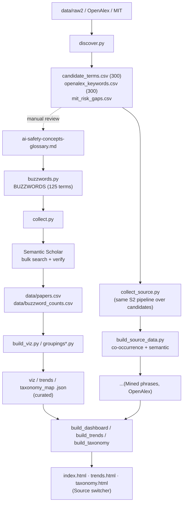

# Methodology: how we collect and visualize AI-safety buzzwords

This document describes the whole pipeline: where the terms come from, how papers are collected per term, how noise is filtered, which metrics and groupings are computed, how it's visualized, and how new buzzwords are discovered. The companion concept glossary is [ai-safety-concepts-glossary_en.md](ai-safety-concepts-glossary_en.md).

---

## 1. Goal and three layers

For every AI-safety concept, get a measurable picture: how many arXiv papers use it, how "hot" it is (citations), when it appeared, which group it lives in — and render all of that interactively.

Three layers, each with its own scripts:

- **Top-down collection** ([buzzwords.py](buzzwords.py) + [collect.py](collect.py)) — over a fixed, curated list from the glossary.
- **Bottom-up discovery** ([discover.py](discover.py)) — pulling candidate terms out of corpora and taxonomies. These candidates are used two ways: (a) to manually grow the glossary and (b) as **standalone sources** for visualization (see §8).
- **Visualization** ([build_viz.py](build_viz.py), [build_source_data.py](build_source_data.py), [build_dashboard.py](build_dashboard.py) / [build_trends.py](build_trends.py) / [build_taxonomy.py](build_taxonomy.py)) — a word cloud, trends, and a groupings map, with switching between sources, metrics, and lenses.

---

## 2. Pipeline overview



---

## 3. Curated vocabulary and queries — `buzzwords.py`

The list is **curated from the glossary**. The structure is `BUZZWORDS`: tuples of `(display_term, cluster, s2_query)`. It currently holds **125 terms** across 19 semantic clusters (glossary sections 1–20; §10 "Umbrella taxonomies" is a meta-section with no tracked terms).

**Query syntax.** Two helpers:
- `p(term)` — a "bare" quoted phrase, for specific multi-word terms (`"prompt injection"`, `"membership inference"`).
- `s(term)` — a phrase **scoped with safety context** `SCOPE`, for generic single-word terms (`bias`, `probing`, `calibration`) that otherwise return a lot of off-topic hits.

`SCOPE` is built from a single `CONTEXT` list (one source of truth — it must match the verification step):

```10:12:buzzwords.py
CONTEXT = ["language model", "large language model", "LLM", "chatbot",
           "AI safety", "AI alignment"]
SCOPE = "(%s)" % " | ".join('"%s"' % c if " " in c else c for c in CONTEXT)
```

S2 bulk syntax: `"phrase"`, `+`(AND), `|`(OR), `-`(NOT), `*`(prefix). Some terms use a custom query with OR-synonyms (`scheming`, `reward overoptimization`, …).

**Surface forms (`VARIANTS`/`variants()`).** A term can be written several ways (`dual-use`/`dual use`, `PII`/`personally identifiable information`). `VARIANTS` defines the forms that count as a hit; otherwise `variants()` auto-derives them. Matching is case-insensitive, on word boundary, **prefix-based** — it catches suffixes (`bias`→`biased`/`biases`) but **not** stem changes (`hallucination`→`hallucinate`), which is why the latter must be listed explicitly. On top of `VARIANTS`, `variants()` also merges human-approved semantic synonyms from `data/variants_approved.json` (see §13).

---

## 4. Collecting papers — `collect.py`

Per buzzword:

1. **Retrieval.** One S2 bulk call: `year=2005-`, `fieldsOfStudy=Computer Science`, `sort=citationCount:desc` (for `scheming` — `publicationDate:desc`, see `SORT_OVERRIDE`), fields `title, abstract, year, publicationDate, citationCount, externalIds`. Up to 1000 candidates **with abstracts**.
2. **Cache** to `data/raw2/<slug>.json`; a rerun reads the cache.
3. 1.2 s pause between calls; up to 5 retries with backoff on error. The S2 key lives in `collect.py` (private repo).

## 5. Filtering and verification

S2 matches **with stemming**, so the raw response is noisy. Three filters:

1. **arXiv only** — keep papers with `externalIds.ArXiv`.
2. **Exact phrase** — a surface form must appear in `title + abstract` as a whole word (`make_matcher(variants(term))`). This kills stemming false positives (`scheme` ≠ `scheming`).
3. **Safety context** (for scoped terms) — if the query was scoped, require at least one `CONTEXT` token. Without it, `bias`/`backdoor`/`probing` pulled in beamforming, DOA estimation, medicine, IoT.

Result of the curated layer: **125 terms → 4,726 unique arXiv papers** (`data/papers.csv`, top-60 by citations per term, deduplicated).

---

## 6. Metrics (7 "weights")

Computed per term; in the artifacts any of them can drive size/sorting:

| Metric | Meaning |
|---|---|
| **Papers** | number of verified arXiv papers (primary weight) |
| **Citations** | sum of those papers' citations |
| **Citations / paper** | mean citations (impact per paper) |
| **Recency** | share of papers from 2024+ (%) — "freshness" |
| **Momentum** | count of papers from 2024+ (recent volume) |
| **Debut yr** | year the term first reached ≥2 papers |
| **Peak yr** | year of the papers-per-year peak |

Plus a per-year time series (2015–2026) — papers and citations per year, for trends.

> Citation caveat: S2 returns a **current** total, so "citations in year Y" = citations of papers **published** in Y (cohort impact), not year-by-year accrual.

---

## 7. Groupings (lenses)

Terms are coloured/laid out by one of several **lenses**. The curated set has four; they're built in `groupings.py` / `groupings_embed.py` and assembled in `lenses.py`:

| Lens | How it's computed |
|---|---|
| **Glossary** | 20 glossary clusters → 8 macro-themes (manual grouping) |
| **MIT risk** | mapping clusters onto the MIT AI Risk Repository taxonomy ([arXiv:2408.12622](https://arxiv.org/abs/2408.12622)), 7 domains / 24 subdomains |
| **Semantic** | paper embeddings **SPECTER2** (S2) → averaged per term → k-means + PCA-2D |
| **Co-occurrence** | term co-occurrence graph over papers → Louvain communities |

Key trick on the map: **Layout = Colour** → clean single-colour clusters (the grouping is "real"); **Layout ≠ Colour** → shows how one grouping cuts across another.

---

## 8. Three visualization sources

The artifacts can switch the **source** — not only the curated glossary, but also bottom-up candidates run through the same pipeline:

| Source | Method | Terms | Papers | Lenses |
|---|---|---|---|---|
| **Curated** | manual glossary (§3–5) | 125 | 4,726 | glossary · MIT · semantic · co-occurrence |
| **Mined phrases** | frequent phrases from abstracts (`discover.py --source raw2`) | 278 | 11,583 | co-occurrence · semantic |
| **OpenAlex keywords** | keywords/topics from OpenAlex | 203 | 6,195 | co-occurrence · semantic |

### How candidate sources are collected — `collect_source.py`

1. From `data/candidate_terms.csv` / `data/openalex_keywords.csv`, take the **top 300** by frequency (dedup, length ≥3).
2. Each phrase → the same S2 pipeline as `collect.py`: bulk search of the bare phrase, `year=2005-`, CS, **exact-phrase verification** in title+abstract.
3. Cache in `data/src_<source>/raw/`; outputs `terms.json` (per-term metrics + series) and `papers.csv` (top-60/term, deduplicated).

**Why not exactly 300.** Fewer than 300 candidates survive — this is **legitimate verification filtering**, not a failure:
- raw2: 300 → **278** (−22: n-gram artifacts with a glued acronym, `retrieval-augmented generation rag`, `vision-language models vlms` — not present verbatim; abstracts write `... (RAG)` with parentheses);
- OpenAlex: 300 → **203** (−97: long topic labels and parenthetical fields, `risk analysis (engineering)`, `context (archaeology)` — not present verbatim in CS arXiv). Plus 1 phrase per source failed on a 429 during collection.

### Groupings for candidate sources — `build_source_data.py`

Glossary/MIT are tied to our own vocabulary and don't apply to foreign terms. Two lenses are computed:
- **Co-occurrence** — Louvain over paper co-occurrence (local, no API);
- **Semantic** — SPECTER2 embeddings of the source's papers (S2 batch, cached in `embeddings.npz`) → k-means + PCA.

It also emits the same formats as curated: `viz_data.json`, `trends_data.json`, `taxonomy_map.json` (cloud SVGs per each of the 7 metrics, per-year streams, map layouts).

---

## 9. Artifacts (three pages)

All pages read the same per-source data and share the nav + a **Source** switcher (Curated / Mined phrases / OpenAlex).

- **Word cloud** ([build_dashboard.py](build_dashboard.py) → `index.html`) — an interactive SVG cloud (size by any of the 7 metrics, colour by any lens) + a top-terms bar chart. Tiles: terms / papers / citations / year span.
- **Trends** ([build_trends.py](build_trends.py) → `trends.html`) — three views: **Atlas** (heatmap/cards — every term on one screen, a per-year heat-strip), **Overlay** (all lines at once, groups hidden via an "eye"), **Themes** (streamgraph of the field's composition over time, papers/citations).
- **Groupings** ([build_taxonomy.py](build_taxonomy.py) → `taxonomy.html`) — one scatter map: **Layout** (position by lens) × **Colour** (colour by lens) × **Size** (radius by metric).

Shared controls: **Source**, **Size** (7 metrics), **Colour**/**Layout** (lenses), theme (light/dark).

---

## 10. Discovering candidates — `discover.py`

Top-down collection by design can't find new terms. A separate module, three `--source` modes; a candidate passes if it's **novel** (not in the glossary text nor in `BUZZWORDS`/`VARIANTS`):

| Mode | Source | What it does | Output |
|---|---|---|---|
| `raw2` | `data/raw2` cache | 2–3-grams from abstracts, ranked by frequency, minus known terms | `data/candidate_terms.csv` |
| `openalex` | [OpenAlex API](https://api.openalex.org) | `keywords`/`topics` of works matching a safety query, aggregated by frequency | `data/openalex_keywords.csv` |
| `mit` | MIT AI Risk Repository | diff of 7 domains / 24 subdomains against the glossary | `data/mit_risk_gaps.csv` |

The lists are **ranked candidates for manual review** — nothing is added to the glossary automatically. They then go two ways: some terms are hand-added to the glossary, and the raw2/openalex lists as a whole become visualization sources (§8). MIT is a risk taxonomy, not a term corpus, so it's only visualized as a coverage/gap analysis.

---

## 11. Known limitations

- **Retrieval depth** — 1000 candidates per query; for high-volume terms (`bias`, `hallucination`) the weight is understated.
- **Exact-phrase verification** drops n-grams with glued acronyms and long topic labels — some candidates legitimately fall out (§8).
- **Candidate sources are noisy:** raw2 contains generic phrases (`findings suggest`), OpenAlex has broad fields (`computer science`, `psychology`). Expected — it's "what the corpus surfaces on its own".
- **Semantic-by-year:** "citations" = cohort impact by publication year, not accrual.
- **`raw_s2_total` is unreliable** (stemming) — compare only by `verified`/`Papers`.
- **glossary/MIT don't exist** for candidate sources — they only have co-occurrence + semantic.

---

## 12. How to run

```bash
# — curated layer —
python buzzwords.py            # stats over the list
python collect.py             # collect papers (caches data/raw2)
python build_viz.py           # metrics + clouds + viz_data (+ groupings*.py lenses)
python trends_data.py; python taxonomy_map.py

# — candidate discovery —
python discover.py --source raw2
python discover.py --source openalex --pages 25
python discover.py --source mit

# — candidate sources as corpora —
python collect_source.py raw2 300      # collect + verify top-300
python collect_source.py openalex 300
python build_source_data.py raw2       # co-occurrence + semantic + formats
python build_source_data.py openalex

# — variant / candidate curation (no fetch; reuses cached embeddings) —
python variants_suggest.py    # -> data/variants_suggestions.csv (synonym forms for review)
python build_triage.py        # -> data/candidate_triage.csv (route candidates)

# — build pages (embed all available sources) —
python build_dashboard.py
python build_trends.py
python build_taxonomy.py
```

### How to add a new buzzword (to the curated set)

1. Add a line to `ai-safety-concepts-glossary.md` (canonical name + link).
2. Add a tuple to `BUZZWORDS` (`buzzwords.py`), and surface forms to `VARIANTS` if needed.
3. `python collect.py` → the term is pulled from S2 and enters the metrics; then rebuild the data and pages.

---

## 13. Enrichment tooling and future work

- **Semantic VARIANTS enrichment (implemented).** Synonyms are only caught if listed, so a paper using an un-listed synonym was silently missed, understating counts. `variants_suggest.py` takes each term's mean-centered SPECTER2 centroid, ranks corpus n-grams by cosine to it, and writes `data/variants_suggestions.csv` for review. Approved forms — human-pruned, guarded against metric inflation by a generic-root blocklist **and** an empirical contamination check on cached candidates (which caught e.g. "harmful content" dragging jailbreak papers into *harmfulness*) — live in `data/variants_approved.json` and are merged in `variants()`. Applied effect: **+741 verified papers (+8.4%)** across 37 terms (e.g. `memorize`/`memorized` for *memorization*, `hallucinate` for *hallucination*). Never auto-injected — human-in-the-loop.
- **Candidate triage (implemented).** `build_triage.py` maps the bottom-up candidate sources (`data/src_raw2`, `data/src_openalex`) onto the 125 curated buzzwords via mean-centered SPECTER2 cosine, routing each candidate into `{variant, related, new-candidate, discard}` (proximity for dedup + coherence to separate concept from noise + a min-papers gate) → `data/candidate_triage.csv`, one labelled sheet for curation.
- **Cross-source validation via OpenAlex (future).** For terms that have an OpenAlex topic ID, pull `works?filter=topics.id:…` as an independent count and compare to our verified count; large divergence flags a `VARIANTS` gap or a scope mismatch. Diagnostic only — never mixed into the primary count.
