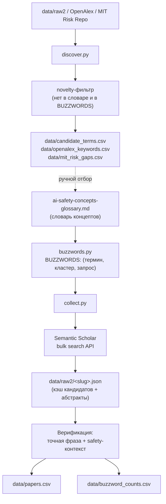

# Методология: как мы собираем баззворды AI Safety

Документ описывает весь конвейер: откуда берутся термины, как по ним собираются статьи, как отсеивается шум, какие метрики считаются и как искать новые баззворды. Сопутствующий словарь концептов — [ai-safety-concepts-glossary.md](ai-safety-concepts-glossary.md).

---

## 1. Цель

Для каждого концепта AI Safety получить измеримую картину: сколько по нему статей на arXiv, насколько он «горячий» (сумма цитирований), в каком смысловом кластере живёт. И отдельно — уметь находить **новые** баззворды, которых ещё нет в словаре.

Две независимые задачи, два набора скриптов:

- **Top-down сбор** ([buzzwords.py](buzzwords.py) + [collect.py](collect.py)) — по фиксированному списку терминов из словаря.
- **Bottom-up обнаружение** ([discover.py](discover.py)) — вытаскивание кандидатов из корпусов и таксономий.

---

## 2. Обзор конвейера



---

## 3. Источник баззвордов — `buzzwords.py`

Список **курируется из словаря**. Основная структура — `BUZZWORDS`: список кортежей `(display_term, cluster, s2_query)`. Сейчас в нём 125 терминов по 20 смысловым кластерам (кластеры совпадают с разделами словаря).

### Синтаксис поисковых запросов

Запрос к Semantic Scholar строится двумя хелперами:

- `p(term)` — «голая» фраза в кавычках. Для достаточно специфичных многословных терминов (`"prompt injection"`, `"membership inference"`).
- `s(term)` — фраза, **сужённая safety-контекстом** `SCOPE`. Для общих однословных терминов (`bias`, `probing`, `calibration`), которые сами по себе дают много офтопа.

`SCOPE` собирается из единого списка `CONTEXT` (одна точка правды, чтобы совпадало с проверкой на этапе верификации):

```10:12:buzzwords.py
CONTEXT = ["language model", "large language model", "LLM", "chatbot",
           "AI safety", "AI alignment"]
SCOPE = "(%s)" % " | ".join('"%s"' % c if " " in c else c for c in CONTEXT)
```

Синтаксис bulk-запроса S2: `"фраза"`, `+` (AND), `|` (OR), `-` (NOT), `*` (префикс). Некоторые термины имеют кастомный запрос с OR-синонимами (например `scheming`, `reward overoptimization`, `pluralistic alignment`).

### Surface-формы для верификации — `VARIANTS` и `variants()`

Один термин может писаться по-разному (`dual-use` / `dual use`, `PII` / `personally identifiable information`). `VARIANTS` задаёт точные поверхностные формы, засчитываемые как попадание; для терминов без явной записи `variants()` авто-выводит формы (замена `-`/пробела). Матчинг регистронезависимый, по границе слова, с любым суффиксом (`bias` ловит `biased`/`biases`).

---

## 4. Сбор статей — `collect.py`

На каждый баззворд:

1. **Retrieval (кандидаты).** Один bulk-вызов Semantic Scholar:
   - `year = 2005-` (с 2005 года),
   - `fieldsOfStudy = Computer Science`,
   - `sort = citationCount:desc` (для `scheming` — `publicationDate:desc`, т.к. по цитированиям свежие литеральные совпадения тонут — см. `SORT_OVERRIDE`),
   - поля: `title, abstract, year, publicationDate, citationCount, externalIds`.
   - Возвращает до 1000 кандидатов **с абстрактами**.
2. **Кэш.** Ответ кладётся в `data/raw2/<slug>.json`; повторный запуск читает кэш и не ходит в сеть. (`data/raw` — старый кэш без абстрактов, не используется активно.)
3. Между сетевыми вызовами пауза 1.2 c; при ошибке — до 5 ретраев с нарастающей задержкой.

Ключ S2 API хранится в `collect.py` (`API_KEY`). Репозиторий приватный.

---

## 5. Фильтрация и верификация

S2 матчит **со стеммингом** и по своей релевантности, поэтому «сырой» ответ шумит. Мы прогоняем каждого кандидата через три фильтра:

1. **Только arXiv.** Оставляем статьи с `externalIds.ArXiv` (нужен стабильный id и ссылка).
2. **Точная фраза.** В `title + abstract` должна встретиться поверхностная форма термина как целое слово (`make_matcher(variants(term))`). Это убирает стемминг-ложняки (`scheme` ≠ `scheming`) и случайные со-совпадения.
3. **Safety-контекст (для scoped-терминов).** Если запрос был сужён (`SCOPE in query`), дополнительно требуем, чтобы в тексте был хотя бы один токен из `CONTEXT`:

```101:105:collect.py
            if not hit(text):
                continue
            if scoped and not ctx_hit(text):
                continue
            verified.append((axid, pp))
```

Зачем третий фильтр: без него под общими словами (`bias`, `backdoor`, `probing`, `provenance`, `containment`) пролезали статьи из совсем других областей — `adaptive beamforming`, `DOA estimation`, `intrusion detection`, медицина, IoT. Фильтр требует, чтобы статья была ещё и «про языковые модели / AI safety».

---

## 6. Метрики — `data/buzzword_counts.csv`

На каждый баззворд:

| Поле | Смысл |
|---|---|
| `raw_s2_total` | «Сырой» total от S2 (стеммингованный) — только для справки, доверять нельзя |
| `candidates_arxiv` | Сколько arXiv-кандидатов пришло в выдаче (до верификации) |
| `verified_arxiv` | Сколько прошло верификацию — **основной вес** концепта (ограничен глубиной ретрива в 1000) |
| `sum_citations_verified` | Сумма цитирований верифицированных arXiv-статей — «горячесть» |

Строки отсортированы по `verified_arxiv` убыв.

---

## 7. Выходные файлы

- `data/raw2/<slug>.json` — кэш кандидатов S2 (с абстрактами), по одному на баззворд.
- `data/buzzword_counts.csv` — метрики по каждому баззворду (см. §6).
- `data/papers.csv` — уникальные arXiv-статьи (top-N=60 по цитированиям на баззворд), с колонками: `arxiv_id, title, publicationDate, year, citationCount, n_matched_terms, matched_terms, matched_clusters, arxiv_url, s2_paperId`. Одна статья может матчиться на несколько терминов/кластеров.

---

## 8. Обнаружение новых баззвордов — `discover.py`

Top-down сбор по построению не находит новых терминов. Для этого — отдельный модуль с общими хелперами (`known_terms`, `novelty_filter`, `write_csv`) и тремя режимами `--source`. Кандидат проходит, если он **новый**: не встречается ни в тексте словаря, ни в `BUZZWORDS`/`VARIANTS`.

| Режим | Источник | Что делает | Выход |
|---|---|---|---|
| `raw2` | кэш `data/raw2` | Извлекает би/три-граммы из абстрактов safety-статей, ранжирует по частоте, вычитает известное | `data/candidate_terms.csv` |
| `openalex` | [OpenAlex API](https://api.openalex.org) | Тянет поля `keywords` и `topics` у работ по safety-запросу (курсорная пагинация), агрегирует по частоте | `data/openalex_keywords.csv` |
| `mit` | MIT AI Risk Repository | Диффит 7 доменов / 24 субдомена таксономии ([arXiv:2408.12622](https://arxiv.org/abs/2408.12622)) против словаря | `data/mit_risk_gaps.csv` |

Все три дают **ранжированные списки кандидатов для ручного ревью** — автоматически в словарь ничего не добавляется. Отобранные термины затем вручную заносятся в словарь и в `BUZZWORDS`.

Почему именно эти источники: у arXiv нет списка keywords (только грубая таксономия категорий), у Semantic Scholar тоже нет концепт-словаря. OpenAlex — единственный с полем `keywords` + 4-уровневой таксономией topics. MIT AI Risk Repository — крупнейший мета-обзор (1700+ рисков из 74 фреймворков), удобен как top-down эталон.

---

## 9. Известные ограничения

- **Глубина ретрива** — 1000 кандидатов на запрос. Для самых массовых терминов (`bias`, `hallucination`) `verified_arxiv` упирается в этот потолок, поэтому вес занижен относительно реального.
- **Остаточный шум** в `discover.py --source raw2`: статистическое извлечение оставляет генерик-фразы (`findings suggest`, `address this gap`) — это ожидаемо, список для ручного просмотра.
- **OpenAlex keywords** крупноблочные (`computer science`, `psychology`) вперемешку с полезными topics — тоже фильтруется глазами.
- **`mit`-эвристика покрытия** грубая (совпадение по отдельным словам), колонка `covered` — подсказка, а не приговор.
- **`raw_s2_total` недостоверен** (стемминг) — сравнивать концепты по нему нельзя, только по `verified_arxiv`.

---

## 10. Как запускать

```bash
# статистика по списку баззвордов
python buzzwords.py

# полный сбор (читает кэш data/raw2, добирает недостающее из S2)
python collect.py

# обнаружение новых кандидатов
python discover.py --source raw2                 # из уже собранных абстрактов
python discover.py --source openalex --pages 25  # из OpenAlex
python discover.py --source mit                  # из MIT Risk Repository
```

Параметры `discover.py` (порог частоты, годы, число страниц, mailto для polite-pool OpenAlex) задаются флагами argparse — значения по умолчанию только там.

### Как добавить новый баззворд

1. Добавить строку в `ai-safety-concepts-glossary.md` (каноническое имя + ссылка).
2. Добавить кортеж в `BUZZWORDS` (`buzzwords.py`) и при нужде surface-формы в `VARIANTS`.
3. Запустить `python collect.py` — новый термин доберётся из S2 и попадёт в метрики.
