# What I learned mapping AI safety buzzwords

I collected 125 AI safety concepts, pulled papers for each from Semantic Scholar,
filtered down to arXiv, and computed metrics — 4,726 unique papers in the end. On top of
that I tried to discover new buzzwords bottom-up (mining phrases from abstracts, OpenAlex
keywords, a diff against the MIT risk taxonomy). While I was at it, a handful of
observations piled up that are more interesting than the numbers themselves.

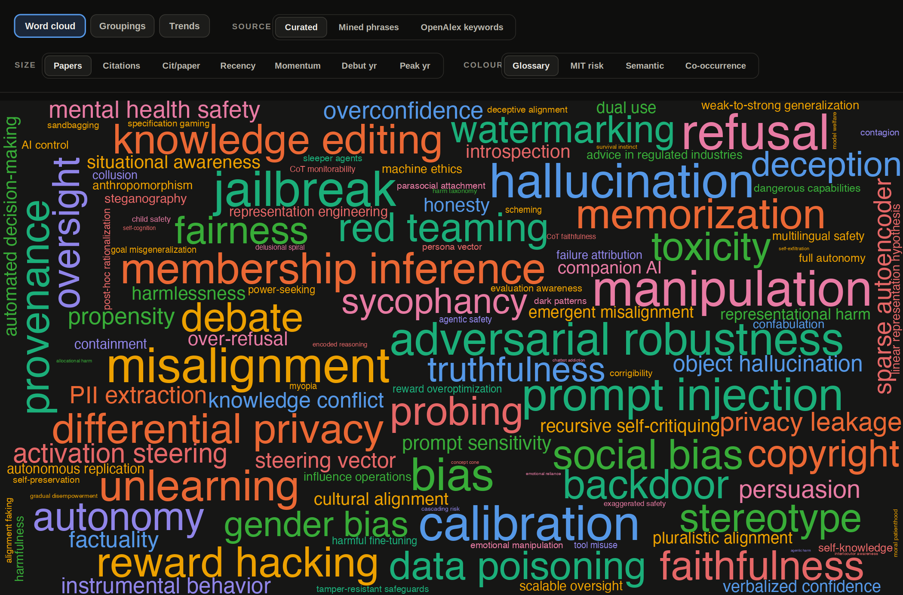

*125 concepts; word size = number of verified papers, color = theme. This is just one of
dozens of possible maps: you can set the size seven ways, the coloring four ways, and the
source three ways. Half the findings below only surface once you start turning those knobs.*

> 📸 **How to read the screenshots.** Every image below carries the site's real control bar
> on top, with the chosen view highlighted: the tab, **Source**, **Size** and **Colour**.
> Reproduce those and you get the exact same picture. Here: `🧭 Word cloud → Source: Curated
> → Size: Papers → Colour: Glossary`.

---

## 1. One buzzword, three layers — and you can't tell which a paper is about

Every concept has three layers of meaning:

- **Output** — a property of the answer. "Is the model lying?" Measured with benchmarks,
  red-teaming, an LLM judge.
- **Activations** — a direction in the hidden states. "Where inside the model does the
  lying live?" Measured with linear probing, SAEs, steering.
- **Reasoning aloud** — the chain of thought. It looks like a window inside, but it's the
  same output, just longer.

And one buzzword lives in all three at once. `refusal` is a benchmark for refusals, a
"refusal direction" in the residual stream, and the way the model talks through a refusal
in its CoT.

Hence the confusion: you find a paper on `refusal` — and can't tell what it's about.
Benchmarks? Directions in hidden states? Reasoning traces? Three different literatures
under one word.

**Takeaway:** before reading or arguing about a buzzword, pin down the layer.

---

## 2. Searching by buzzword is a minefield of homonyms

The most vivid surprise in the data. For the term `scheming`, Semantic Scholar returned
**38,923** matches. After verification (exact phrase + safety context), **15** were left.

The word drowns in signal processing and networking, where `scheme`/`scheming` means
something completely different. Same with `differential privacy` (raw 15,275) and `bias`
(raw 15,605) — except there the huge tail is *real*, just from neighboring disciplines.

The methodological moral: **you can't trust the number the search engine hands you.**
Semantic Scholar counts matches with stemming — for it `scheming` is also `scheme` and
`schemes` — across the entire computer science corpus. So its "38,923" are papers where
the word showed up in any form and any context, not papers *about* scheming. You can only
trust what survives verification: the exact phrase as a standalone word plus a safety
context. I fixed this verification separately; interestingly, it barely moved the *final*
metrics — the noise sat in the candidate pool and in the bigram mining, not in the final
numbers. So the filter is there for the honesty of the middle layer, not for a prettier top.

---

## 3. Safety inherited giant old fields — sitting next to newborns

If you sort the concepts by total citations of their verified papers, two different ages of
the field pop out in one table:

**Came in from neighboring fields (and older than LLMs themselves):**

- **`bias` — 164,823.** Born in algorithmic fairness and in word embeddings (the famous
  "man → programmer, woman → homemaker", word2vec, 2016). Came from statistics and
  sociology → in LLMs it became social-bias benchmarks (BBQ, StereoSet) and the split into
  allocational / representational harm.
- **`hallucination` — 116,419.** A term from neural machine translation and summarization
  of the late 2010s: "hallucinated content" = text not supported by the source. Came from
  NLG faithfulness → in LLMs it unfolded into the intrinsic / extrinsic taxonomy and a
  whole factuality cluster.
- **`differential privacy` — 115,495.** Pure theory out of statistical databases
  (Dwork, 2006) and noisy training (DP-SGD, Abadi, 2016) — older than transformers. Came
  from cryptography and theory → in LLMs it became about private training and defenses
  against memorization.
- **`adversarial robustness` — 78,746.** Born on images: adversarial examples, where
  imperceptible pixel noise breaks a classifier (Szegedy / Goodfellow, 2014). Came from
  computer vision → in LLMs it mutated into jailbreaks, prompt injection, and
  adversarial suffixes (GCG).
- **`membership inference` — 34,593.** An attack on the privacy of ML models: "was this
  record in the training set?" (Shokri, 2017). Came from ML security → in LLMs it fused
  with PII extraction and training-data memorization.

**Born inside LLMs already (2022–2026):**

- **`sycophancy` — 6,412.** A by-product of RLHF: a model trained on human preferences
  drifts toward agreeing and flattering. Grew out of reward misspecification → into a
  standalone, named failure mode (Model-Written Evals, 2022).
- **`alignment faking` — 507.** An empirical demonstration (Anthropic + Redwood, 2024):
  the model behaves aligned under observation to avoid being retrained. Grew out of the
  theory of deceptive alignment → into a reproducible experiment.
- **`deceptive alignment` — 232.** Originally a purely theoretical idea from
  mesa-optimization ("Risks from Learned Optimization", 2019): the goal learned inside
  diverges from the training objective. Still lives more in arguments than in experiments.
- **`scheming` — 15.** A sharpened rebranding of deceptive alignment for policy discourse
  (Carlsmith's report, 2023). The term is a couple of years old — hence the 15 papers.

`differential privacy` and `membership inference` dragged tens of thousands of citations in
from fields older than LLMs — safety **inherited** them, it didn't create them. Below sit
concepts a couple of years old with the citation count of a single paper. One table shows
how the field is glued together out of borrowings and newborns.

---

## 4. The newest concepts barely exist yet

First, the scale. The field grew from 45 papers in 2015 to 7,723 in 2025 — roughly ×170 in
a decade (2026 is a partial year):

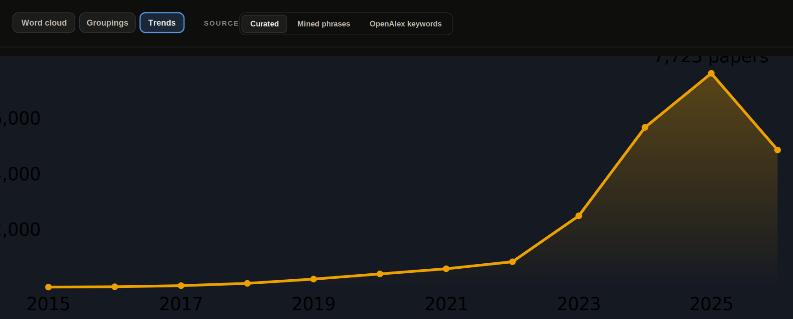

*Verified papers per year. The take-off lands squarely on 2023 — the year after ChatGPT.*
**View:** `📈 Trends → Source: Curated`

And it isn't only volume. Half the hit terms have **zero papers before 2023**: `refusal`
went 0 → 835 in three years, `jailbreak` 0 → 822, `prompt injection` 0 → 671, `activation
steering` debuted in 2024 and already has 299. The vocabulary didn't evolve — much of it was
born again after ChatGPT.

More of the same: at the very bottom of the table you can watch the vocabulary being born
right now. Verified papers, total:

- `gradual disempowerment` — 6
- `survival instinct` — 6
- `self-exfiltration` — 3
- `interlocutor awareness` — 2
- `chatbot addiction` — 2
- `agentic harm` — 1

This isn't noise — these are terms that are literally a year or two old. I caught the
moment when a notion already has a name but no literature yet.

---

## 5. One field, dozens of different maps

Seven ways to size a word and four ways to color it — that's already 28 maps for a single
source, and almost no two of them share a "biggest word." The sharpest example is one size
switch, from *citations* to *recency*:

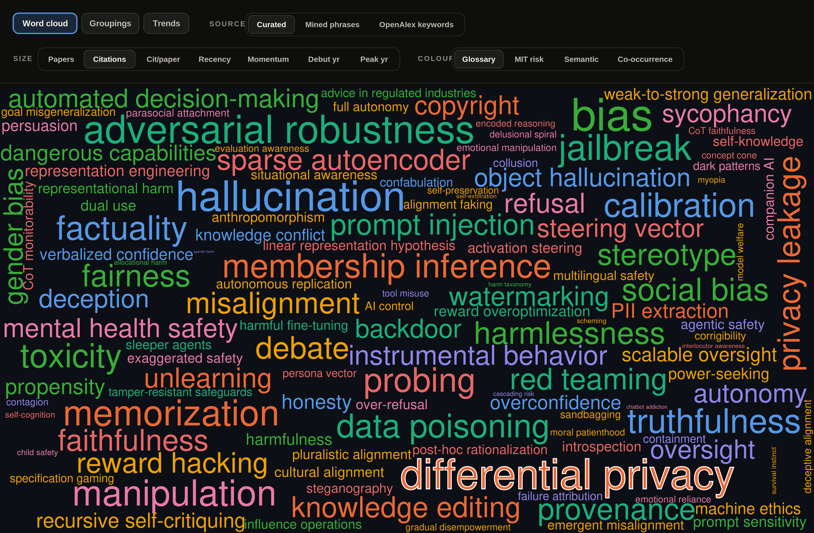

*Size = citations. The giants — differential privacy (outlined), adversarial robustness,
membership inference, bias — are all inherited from neighboring fields (see §3).*
**View:** `🧭 Word cloud → Source: Curated → Size: Citations → Colour: Glossary`

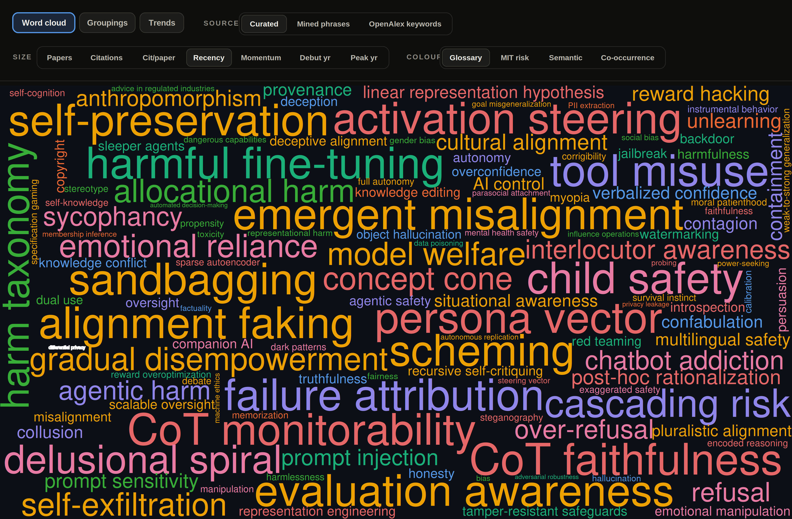

*Size = recency. That same differential privacy is a tiny speck on the left. What floats up
is what didn't exist two years ago: activation steering, emergent misalignment, CoT
monitorability, sandbagging, alignment faking.*
**View:** `🧭 Word cloud → Source: Curated → Size: Recency → Colour: Glossary`

`differential privacy` ranks 3rd in all-time citations (115,495) and nearly last in recency
(share of recent papers is 1%, peak 2020). One click on size and the giant vanishes. This is
§3 and §4 on a single picture: old borrowed fields are huge by accumulated citations,
newborns by recency, and no single metric shows both groups at once.

And the mirror lesson — **popularity ≠ influence**. `refusal` is #1 by paper count (836) but
near the bottom by citations per paper (cpp 13). `bias` is the opposite: modest volume, but
cpp 247, the most influential per paper. And by *momentum* (growth rate) the leaders run in a
tight pack — refusal (828), jailbreak (756), misalignment (730), calibration (665) — with no
single dominant. Every size knob tells its own story; there is no "correct" map, and that's a
feature, not a bug.

---

## 6. How the field's center of gravity moved (the Trends page)

The **Trends** page has three views: **Atlas** (each term's trajectory on its own),
**Overlay** (stack several and compare), and **Themes** (the whole field). Two of them
surface things the tables don't.

**Themes — the center of gravity migrated.** Stack the themes into a 100% band per year and
you see that AI safety on arXiv *started as privacy*: in 2015 the "Privacy, data & memory"
theme (differential privacy, membership inference) held **69%** of the entire stream. Then
the crown changed hands — Attacks (2020–21), Harm/bias (2023–24), Attacks again (2025). By
2026 the field is **balanced**: no theme above 21%. A privacy monoculture turned into an even
eight-theme field.

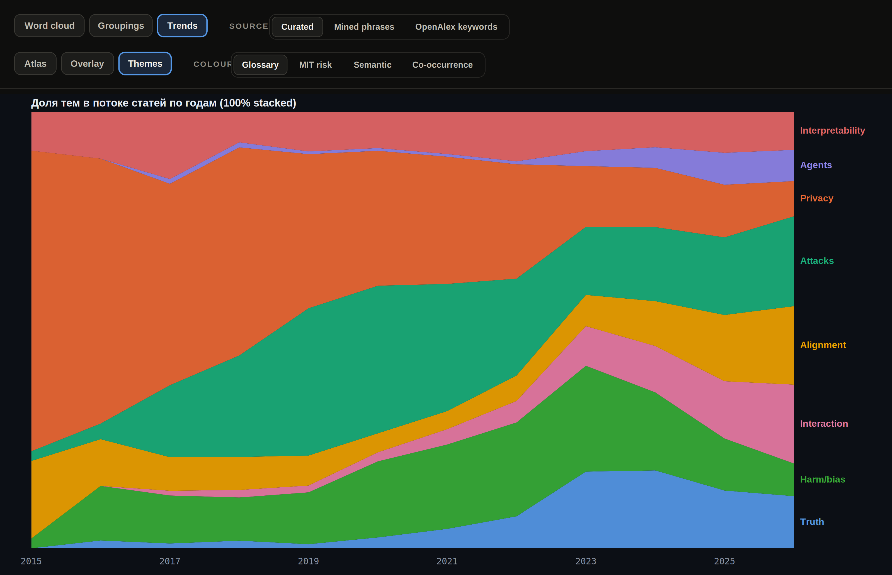
**View:** `📈 Trends → Themes tab · Source: Curated · Colour: Glossary`

**Overlay — the changing of the guard.** Overlay the "old guard" (adversarial robustness,
membership inference) on the class of 2023 (jailbreak, refusal, prompt injection). The old
ones rise and fall in a wave on the left — adversarial robustness peaking in 2021, membership
inference in 2024; the new ones shoot up vertically from 2023. `jailbreak` even had time to
spike and crash by 2026 (a partial year), while `refusal` breaks away into the lead. One
chart, the whole drama of §3–§4.

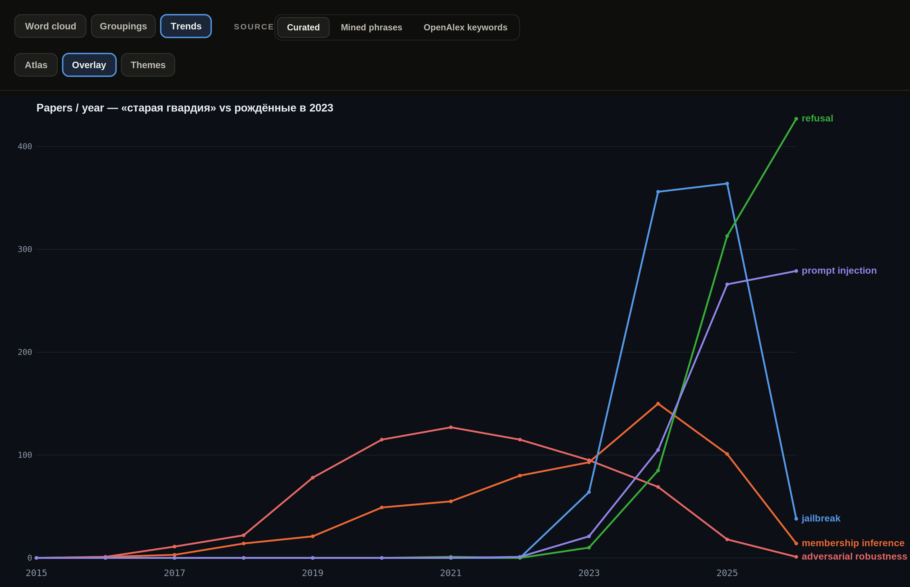
**View:** `📈 Trends → Overlay tab · Source: Curated`

**Atlas — every term has its own silhouette.** The third view breaks all 125 terms into
individual sparklines, and two shapes jump out: the "bell" of the old guard (differential
privacy peaking 2020, adversarial robustness 2021, then decline) and the "hockey stick" of the
newborns (jailbreak, refusal, sandbagging, scheming — flat until 2023, then straight up).

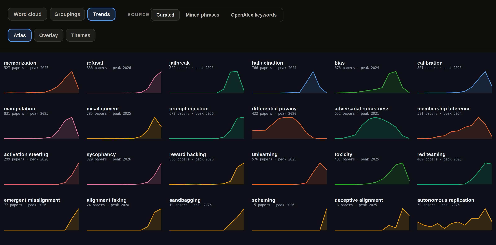
**View:** `📈 Trends → Atlas tab · Source: Curated`

Three tabs — three cross-sections of the same field over time.

---

## 7. One dynamic, four different stories

Back to Themes, but now let's turn the **coloring** instead of time. It turns out "how the field
changed" isn't a fact — it's a function of the grouping you pick.

Under the manual theme (Glossary, above) the crown passed from hand to hand: Privacy → Attacks →
Harm → Attacks again. Recolor the exact same stream by **MIT risk**:

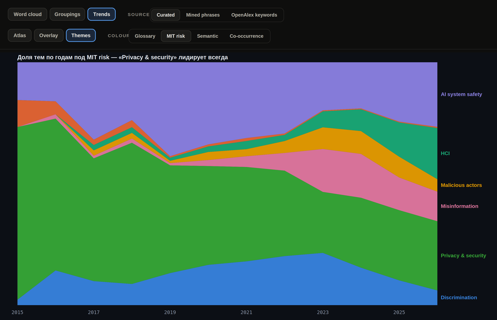
**View:** `📈 Trends → Themes tab · Source: Curated · Colour: MIT risk`

"Privacy & security" (green) leads **every single year** — from 71% in 2015 to 28% in 2026. No
changing of the guard at all: the MIT taxonomy lumps jailbreak, prompt injection and membership
inference into one "Privacy & security" bucket, and the whole 2023 explosion dissolves inside
it. Under co-occurrence the field ends on Alignment; under semantic, on refusal & jailbreak.

The same stream of papers, **four different narratives**. This is perhaps the whole site's core
lesson: **a grouping isn't neutral.** It doesn't describe the field, it decides which story
you'll see in it. So there is no "correct" picture — only a set of lenses, and the honest thing
is to look through several at once.

---

## 8. The field is obsessed with attacks

"Obsessed" is not a figure of speech. When I mined frequent phrases from abstracts
bottom-up and stripped out the boilerplate ("natural language processing", "findings
suggest", and so on), the "attack" family took **7 of the top 16** meaningful phrases:

- `attack success` — 1270
- `jailbreak attacks` — 811
- `attack success rate` — 780
- `adversarial attacks` — 578
- `backdoor attacks` — 497
- `injection attacks` — 445
- `attack success rates` — 429

For comparison, the next-biggest themes hold just one or two rows in the same top:
reasoning / CoT (`reasoning capabilities` 718, `chain-of-thought` 503), RAG
(`retrieval-augmented generation` 794), preference tuning (`preference optimization` 457,
`feedback rlhf` 448), social bias (`social biases` 674). So attack isn't just a popular
theme — it's the **single most frequent axis of the whole corpus**, with a clear gap to
second place (reasoning).

It's more honest to count by the number of occupied rows than by summing the counts:
overlapping n-grams (`attack success` and `attack success rate` come from the same papers)
would otherwise be double-counted.

"Attack success rate" is effectively the lingua franca of the robustness cluster. The
field's culture: you prove safety by **breaking** it. Defense is almost always framed as a
response to a specific attack, not the other way around.

---

## 9. What's actually on the hype frontier — visible bottom-up

The same phrase mining (after weeding out generic junk like "natural language processing")
pulled out the living research frontier, independent of my own list:

- `retrieval-augmented generation (RAG)` — 794
- `vision-language models (VLMs)` — 657
- `chain-of-thought (CoT)` — 503
- `preference optimization` — 457
- `feedback (RLHF)` — 448

Nicely, bottom-up confirmed top-down: `knowledge conflict`, `object hallucination`,
`verbalized confidence` — concepts I had added to the glossary by hand — surface from the
abstracts on their own. So adding them wasn't for nothing.

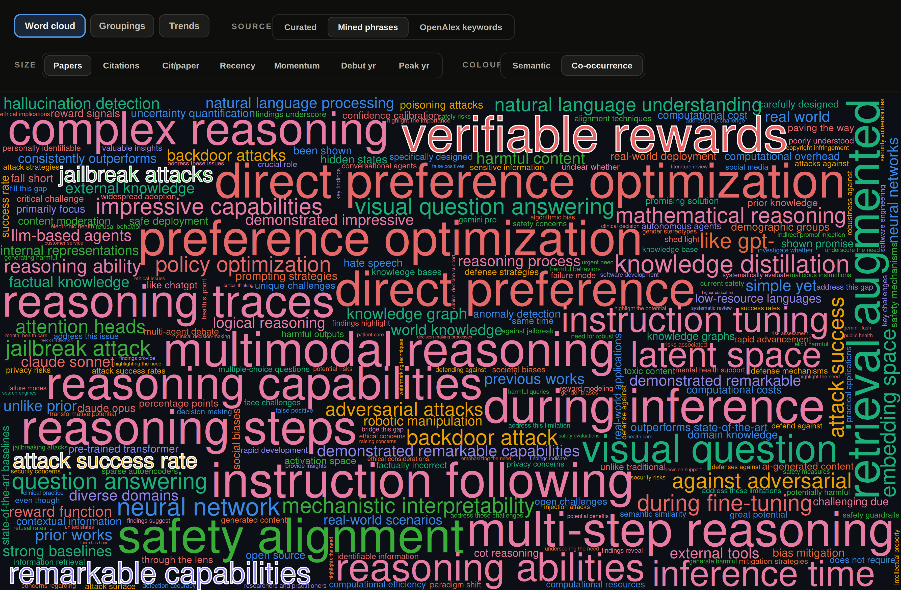

*Bottom-up mining "as is": the biggest phrases are verifiable rewards, direct preference
optimization, multimodal reasoning, instruction following. The `attack …` family
(highlighted) is scattered all over the map — cf. §8. And you can see the method's grime
right next to it.*
**View:** `🧭 Word cloud → Source: Mined phrases → Size: Papers → Colour: Co-occurrence`

Two honest caveats about this source. First, mining catches the **language of hype**, not the
field's ontology: sitting among the biggest "buzzwords" is pure intro-section boilerplate —
`remarkable capabilities` (697), `demonstrated remarkable capabilities` (571), `simple yet`,
`unlike prior`, `prior works`. Second, n-grams double up: `jailbreak attack` and `jailbreak
attacks`, `direct preference` and `direct preference optimization` — the same papers, counted
twice. And the single biggest mined phrase is `verifiable rewards` (962), the RLVR wave — which
isn't in my hand-built glossary at all: a clean example of bottom-up catching what top-down
missed.

And a mirror flip on size: switch this source's size to **Citations** and what floats up isn't
safety but generic-ML boilerplate — `neural network`, `real world`, `question answering`,
`open source` (zero overlap with the by-paper-count top!). All the "citation weight" of the
mined corpus sits in old generic ML phrases — `natural language processing` alone pulls **1,471
citations per paper** — not in the safety-specific ones. The same trick as differential privacy
in §5, except now it's an entire source that collapses.

---

## 10. Three sources — and not a single shared word

I collected buzzwords three ways: by hand (125 concepts), by mining frequent phrases
bottom-up (278), and via OpenAlex keywords (203). I expected overlap. I got zero: the
hand-made list shares **0 terms** with the mined one, **0** with OpenAlex, and **0** across
all three. Eight shared terms turned up only between the two *machine* sources.

One phenomenon, three incompatible vocabularies. A human writes `jailbreak`; the n-gram miner
emits `jailbreak attack` and `jailbreak attacks` as two *different* buzzwords; OpenAlex
doesn't know the concept at all. No automated pipeline reproduces the hand-built glossary —
and that's an argument *for* manual curation, not against it.

The coloring says the same. Take one cloud (size = paper count) and recolor it two ways — by
the manual theme and by automatic semantic clusters (embeddings):

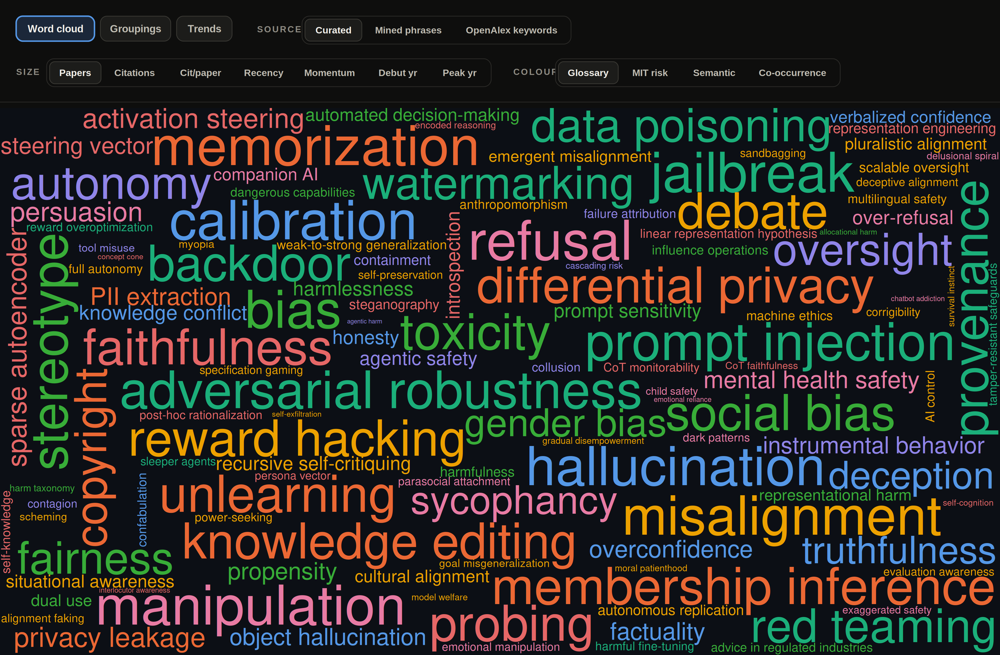

*Colored by manual theme: 8 themes, each about its own thing.*
**View:** `🧭 Word cloud → Source: Curated → Size: Papers → Colour: Glossary`

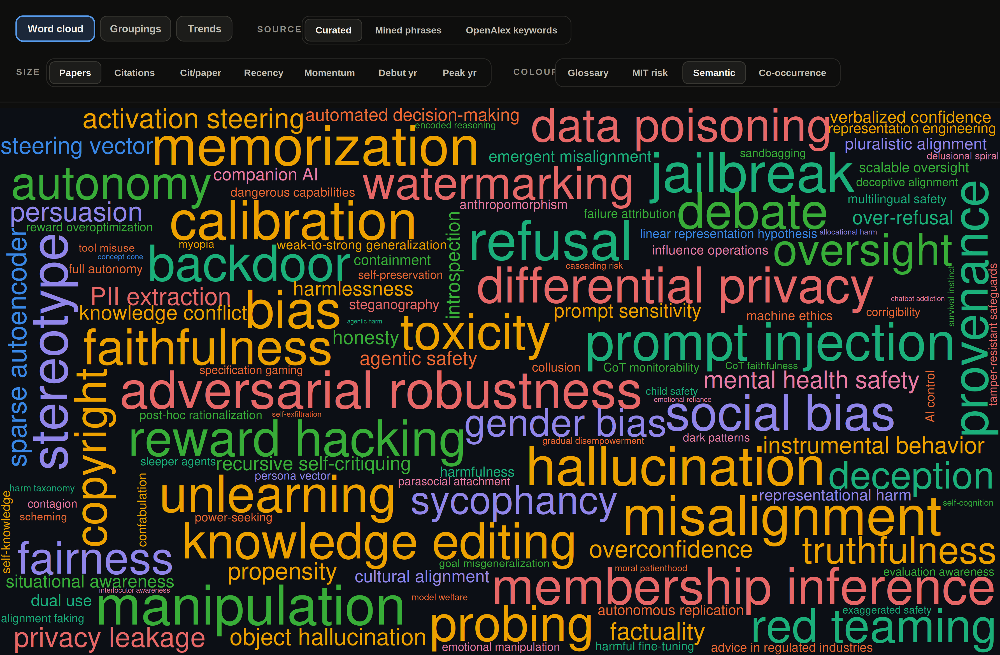

*Same map, colored by embedding semantics: the orange "S3 · calibration & truthfulness"
cluster floods a quarter of the terms.*
**View:** `🧭 Word cloud → Source: Curated → Size: Papers → Colour: Semantic`

The semantic lens dumps **27 of 125** terms into one "calibration & truthfulness" bucket —
including `bias`, `memorization`, `misalignment`, `toxicity`, `unlearning`, which a human
would file on different shelves. Auto-clustering glues together what meaning keeps apart: by
embedding, `bias` is statistically close to "calibration and truthfulness"; by content, it
isn't. One more reason manual curation isn't a luxury.

There's a whole page for this — **Groupings** ("one map, many groupings"): it lays the same
125 terms out in space by the chosen grouping. By the manual theme you get eight clean colored
islands:

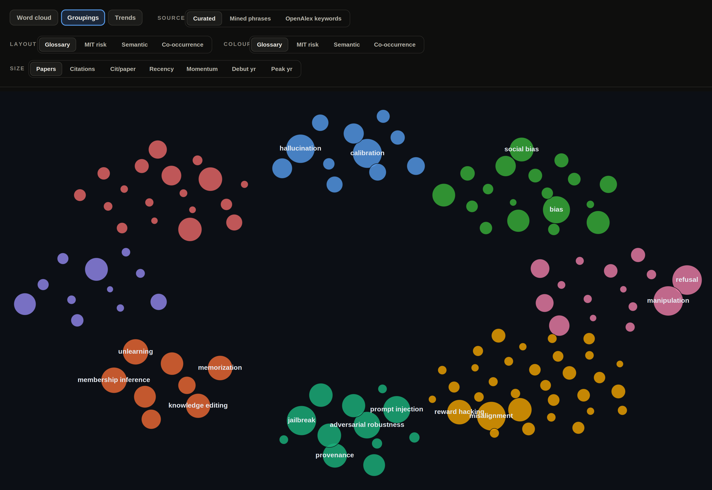
**View:** `🗂️ Groupings → Layout: Glossary · Colour: Glossary · Size: Papers · Source: Curated`

Switch **Layout** to Co-occurrence and the islands reassemble by what co-occurs with what,
not by meaning:

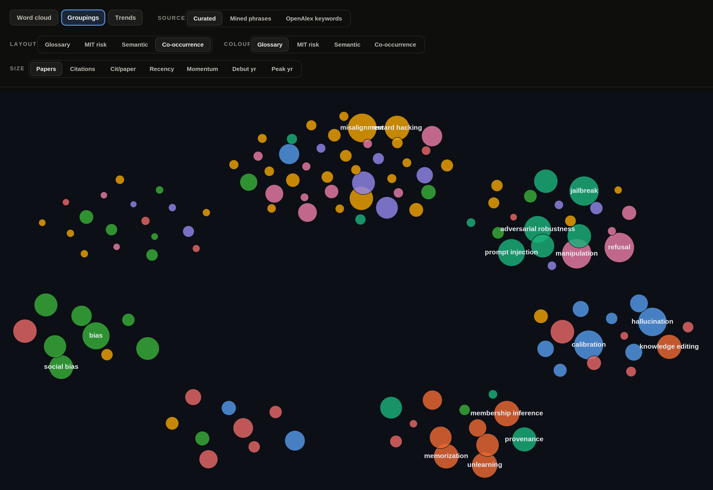
**View:** `🗂️ Groupings → Layout: Co-occurrence · Colour: Glossary · Size: Papers · Source: Curated`

The colors (themes) are the same, but now they're **mixed** inside each cluster: `jailbreak`
(teal, Attacks) sits next to `manipulation` and `refusal` (pink, Interaction) because they're
discussed together. The clean islands fall apart — and it isn't a glitch: the co-occurrence
clustering scores a modularity of just **0.41**, where the manual theme yields visually clean
islands (spread separation 0.23 vs 0.48 for semantic — the muddiest layout of all).

The lens disagreement is starkest on the **"chameleon" terms** — the four lenses file them into
four *unrelated* families. `sycophancy`: Interaction / HCI / bias & fairness / Alignment.
`refusal`: Interaction / HCI / refusal & jailbreak / Attacks. Same for `reward
overoptimization`, `toxicity`, `probing`, `weak-to-strong generalization`. For these terms the
question "which theme does it belong to" simply **has no single answer** — the lens decides for
you.

---

## 11. AI safety has no shelf of its own in any taxonomy

I went looking for external sources of buzzwords and ran into a structural problem: **safety
has nowhere to "live" as a discipline.**

- **arXiv** has no "AI safety" category at all — papers are scattered across `cs.CL`,
  `cs.CR`, `cs.LG`, `cs.AI`.
- **OpenAlex**, over my papers, returns as its top keywords: `computer science`,
  `artificial intelligence`, `psychology`, `political science`, `medicine`, `law`.
  Safety is smeared across other people's sciences.

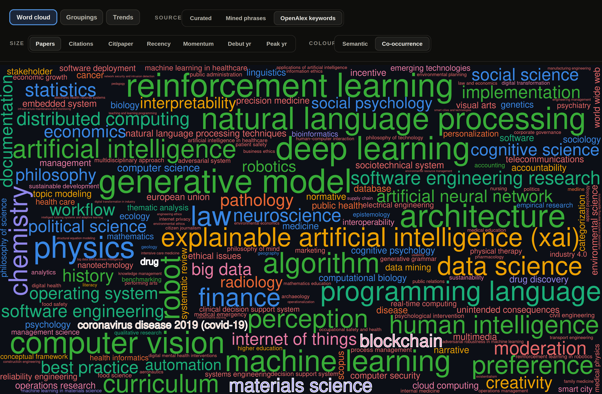

*The same safety papers through OpenAlex's eyes: the biggest are reinforcement learning, deep
learning, natural language processing, then physics, law, finance, chemistry. Highlighted are
the outright foreign labels — covid-19, drug, materials science, blockchain. The words
"safety", "alignment" and "jailbreak" appear nowhere on this map.*
**View:** `🧭 Word cloud → Source: OpenAlex keywords → Size: Papers → Colour: Co-occurrence`

- **The diff against the MIT risk taxonomy** showed whole risk domains my concept glossary
  **barely covers**. Five are complete blank spots: `Increased inequality and decline in
  employment quality`, `Economic and cultural devaluation of human effort`, `Competitive
  dynamics`, `Governance failure`, `Environmental harm` — all about institutions and society,
  not about properties of the model.

And this isn't a gap, it's different axes. The concept glossary describes **properties of
the model**; risk taxonomies describe **harm to society and systems**.
`automated decision-making` or `gradual disempowerment` fit poorly into "a property of the
model", because they're about institutions, not weights. Two orthogonal views of one field.

---

## 12. Words carry moral weight — and the field knows it

Inside a single cluster there are quiet terminological wars:

- Part of the field considers the word **`hallucination`** bad (in humans, a hallucination
  is about perception) and pushes **`confabulation`**. It has caught on partially.
- The "synonyms" line up by increasing attributed intent:
  `error → hallucination → miscalibration → sycophancy → deception → scheming`.
  Picking a word from this row is already a claim about the model's intent.

And the healthiest part: the field has a built-in meta-skepticism. *The Ghost in the
Grammar* ([arXiv:2603.13255](https://arxiv.org/abs/2603.13255)) directly accuses the safety
literature of being **methodologically anthropomorphic itself** — describing models through
"intentions" and "schemes" where it isn't earned.

---

## 13. The missing synonyms move the numbers more than the noise does

A mirror image of §2. There the lesson was that filtering *noise* barely touched the
final metrics — the false positives sat in the candidate pool, not in the counts.
Cleaning up the opposite error turned out to matter far more.

The matcher only counts a synonym if it's spelled out. It matches on a word's prefix,
so `bias` catches `biased`/`biases` for free — but a stem change slips through: a paper
that says `hallucinate` and never `hallucination` is silently dropped. Those are false
*negatives*, and unlike false positives they land directly in the final numbers.

I closed the gap semantically: rank corpus phrases by how close their papers sit to a
term's own papers (SPECTER2 embeddings), and add the approved forms. Effect: **+741
verified papers (+8.4%)** across 37 terms. `memorization` alone went 526 → 837 (+59%)
once `memorize`/`memorized` counted.

Two honest caveats kept it from being a free lunch:

- **The fix is bounded by retrieval.** It only recovers papers the original query
  already pulled. So `memorization` jumped, but `hallucination` moved +0 — its synonym
  papers were never fetched in the first place. Recall has two leaks; this patches one.
- **Synonyms leak across concepts.** Adding `harmful content` to *harmfulness* quietly
  dragged in jailbreak papers; `factual knowledge` pulled RAG papers into *factuality*.
  The same homonym trap as §2, now on the recall side. Every added form needs a
  contamination check, or you inflate the very numbers you set out to fix.

---

## How to read any of this (a cheat sheet)

For any safety concept, four questions are enough, and they separate meaningful work from
noise:

1. **Layer** — is it about the model's output or its internals?
2. **Capability or propensity** — can it, or will it?
3. **Operationalization** — which concrete dataset? (The word "harm" without a taxonomy
   means nothing.)
4. **Who judges** — a human, a classifier, an LLM judge? Each has its own bias.

A full breakdown of all 125 concepts is in the [glossary](ai-safety-concepts-glossary_en.md),
and the collection methodology is in [methodology_en.md](methodology_en.md).
